# **PesonnelAPI**

## README.md

</br>


##### _Photo by Mick Haupt (unsplash)_

</br>

### **Index:**

1. [Project Purpose](<#Project-Purpose>)
1. [Quickstart](#Quickstart)
1. [API Endpoints](<#Endpoints>)
    - [Authentication](#Authentication)
    - [Album](#Album)
    - [Artist](#Artist)
    - [Track](#Track)
    - [Musician](#Musician)
    - [Credit (track_musician)](#Credit)
    - [Instrument](#Instrument)
    - [Errors](#Auth-and-Validation-errors-examples)
1. [Github Repository](https://github.com/bccbass/PersonnelAPI)


</br>  

  

### **Project Purpose**

There is currently no centralized database cataloging all the musicians that performed and contributed to recorded albums. While the information can be searched for on the internet it is usually found in disparate places with varying degrees of accuracy. Although the United States Library of Congress keeps a record of all released musical albums, the scope of their catalog falls only to the main recorded release and not the more granule details. Because the music industry has often lacked self-awareness of the cultural significance of its end product a great deal of data is either missing or hard to access from the original source material. It is only with the privilege of hindsight that the cultural importance of the contributions of the many side musicians has come into light, as is evidenced by the many books and documentaries illuminating the seldom noticed world of supporting session musicians (Muscle Shoals(2013), The Wrecking Crew(2014), countless jazz histories and biographies released over the last 50 years). The App aims to create a platform to document and store records of musical contributions in an organized and centralized database. It aspires to facilitate interactions with the information in useful and novel ways; discovering all session musicians that performed on your favorite song, or listing all of the tracks a given musician played on throughout their career. The Personnel API seeks to ameliorate the problem of a historical dearth of information regarding musicians contributions, creating a rich ecosystem for music fans and scholarly researchers alike to find information about our shared musical cultural heritage, fostering a deeper understanding and appreciation of the unsung heroes that created the magic for the music we love. 

</br>  
</br>

## **_Quickstart_**

1. Open a new terminal window, run PSQL and create a new PostgreSQL database entitled `personnel`:
   ```psql
   ~psql
   CREATE DATABASE personnel;
   ```
2. Connect to the new database:
   ```psql
   \c personnel
   ```
3. Create a New User, set a Password and grant all privileges:

   ```psql
   CREATE USER <user> WITH PASSWORD <password>;

   GRANT ALL PRIVILEGES ON DATABASE <database_name> TO <user>;
   ```

4. In the main project directory create a `.env` file using `.env.sample` as a template.
   - The Database URI should be formatted as:  
   `Database+adapter://<user>:<password>@<host name>:<port>/<database>`  
     eg:
     
```py
  DATABASE_URI='postgresql+psycopg2://<YOUR_USER_NAME>:<YOUR_USER_PASSWORD>@localhost:5432/personnel'
  ```
   - The JWT Secret should be something secure.
     - Hint:
       generate secret code in the terminal:
     ```bash
         $ python3 -c 'import secrets; print(secrets.token_hex())'
     ```
5. You should now be able to navigate to the `src/` directory and run the bash script from the terminal to create a .venv folder, install requirements, set up the database tables and seed them with sample data:

   ```bash
   cd src/
   ``` 

   ```bash
   $ bash create_and_seed.sh
   ```

6. The database and project environments are now set up. To run the app from the terminal make sure you are in the `src/` directory and:  
   - Activate the virtual environment  

   ```bash
       $ source .venv/bin/activate 
   ```  

      - And run the program  

   ```bash  
       $ flask run
   ```  
   The server should now be running on port 5000. To run the app from a different port create a new .flaskenv file based on the .flaskenv.sample template and assign a different port.  


7. Authentication: To use the API a user must register via the `/users/register` route. The user may then login via the `/users/login` route, which will result in a JWT token being sent in a JSON response. This token is valid for 30 days and must be included in the authentication header for each HTTP request as a bearer token. After 30 days the user may simply login again to generate a new token.  

</br>  
</br>

### **API Endpoints**


All endpoints require an account and for the user to be logged in with an active JWT token. The token has an expiration 30 days after creation, logging in again will grant a fresh new token. At this point most of the public functionality of the API is read only, with creation, updating and deletion of resources reserved for users with admin credentials.

1. [Authentication](#Authentication)
1. [Album](#Album)
1. [Artist](#Artist)
1. [Track](#Track)
1. [Musician](#Musician)
1. [Credit (track_musician)](#Credit)
1. [Instrument](#Instrument)
1. [Errors](#Auth-and-Validation-errors-examples)

## Authentication

Authentication routes cover the concerns of Users, inlcuding logging in and admin credentials. 

### **POST** `/users/register`
Create a new new user so you can interact with the API
- Methods: **POST**
- parameters: None
- Headers: None
- Response: _201_
- Response: _400_


### **POST** `/users/login`
Log in to your account so you can access a token to interact with the API
- Methods: **POST**
- parameters: None
- Headers: None
- Response: _200_
- Response: _400_, _401_

### **POST** `/grant_admin_access/{user_id}`
Admins are allowed to grant admin access to users.  
*Admin credentials required.*

- Methods: **POST**
- parameters: 
  - **user_id**: `Integer` _Required_  
     The id of the user you are attempting to grant admin access to.
- Headers: Authorization: {Bearer Token}
- Response: _202_
- Response: _401_, _404_

### **GET** `/users`
Retrieves a list of all users in the database.  
*Admin credentials required.*

- Methods: **GET**
- parameters: None
- Headers: Authorization: {Bearer Token}
- Response: _200_
- Response: _401_

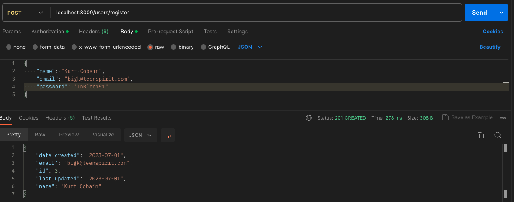
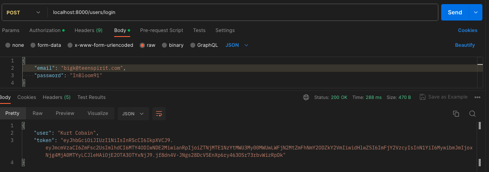
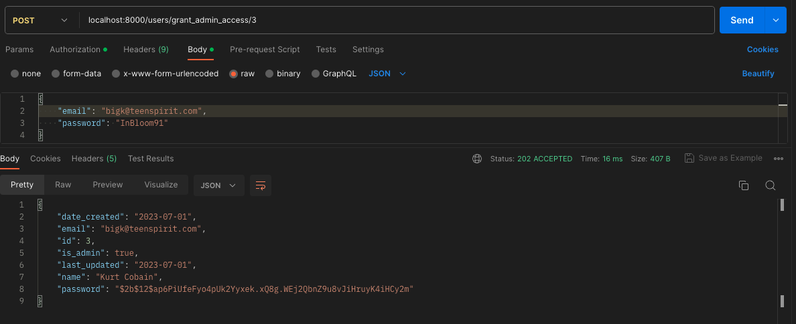
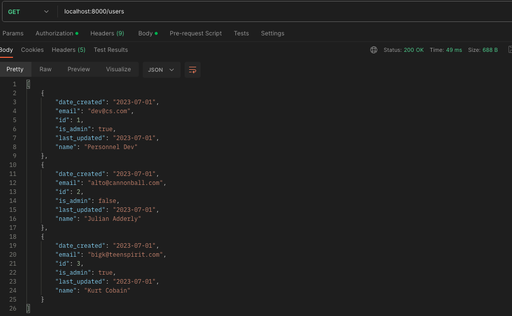

<hr>  

## Album

Albums are releases forming a collection tracks by a given artist. 


### **POST** `/albums`

Creates a new album record and adds to the database.  
*Admin credentials required.*

- Methods: **POST**
- Parameters: None
- Headers: Authorization: {Bearer Token}
- Response: _201_
- Response: _400_, _401_  


### **GET** `/albums`

Retrieves a list of all albums in the database.

- Methods: **GET**
- parameters: None
- Headers: Authorization: {Bearer Token}
- Response: _200_
- Response: _401_  


### **GET** `/albums/{album_id}`

Retrieves a single album from the database.

- Methods: **GET**
- Parameters:
  - **album_id**: `Integer` _Required_  
     The id of the album you are attempting to access.
- Headers: Authorization: {Bearer Token}
- Response: _200_
- Response: _401_, _404_


### **PUT/PATCH** `/albums/{album_id}`

Update an album from the database.  
*Admin credentials required.*

- Methods: **PUT/PATCH**
- Parameters: 
  - **album_id**: `Integer` _Required_  
     The id of the album you are attempting to update.
- Headers: Authorization: {Bearer Token}
- Response: _201_
- Response: _400_, _401_, _404_


### DELETE `/albums/{album_id}`

Deletes an album from the database.  
*Admin credentials required.*

- Methods: DELETE
- Parameters: 
  - **album_id**: `Integer` _Required_  
     The id of the album you are attempting to delete.
- Headers: Authorization: {Bearer Token}
- Response: _200_
- Response: _401_, _404_

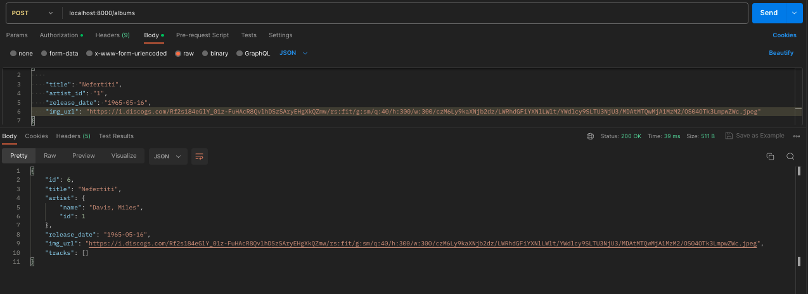
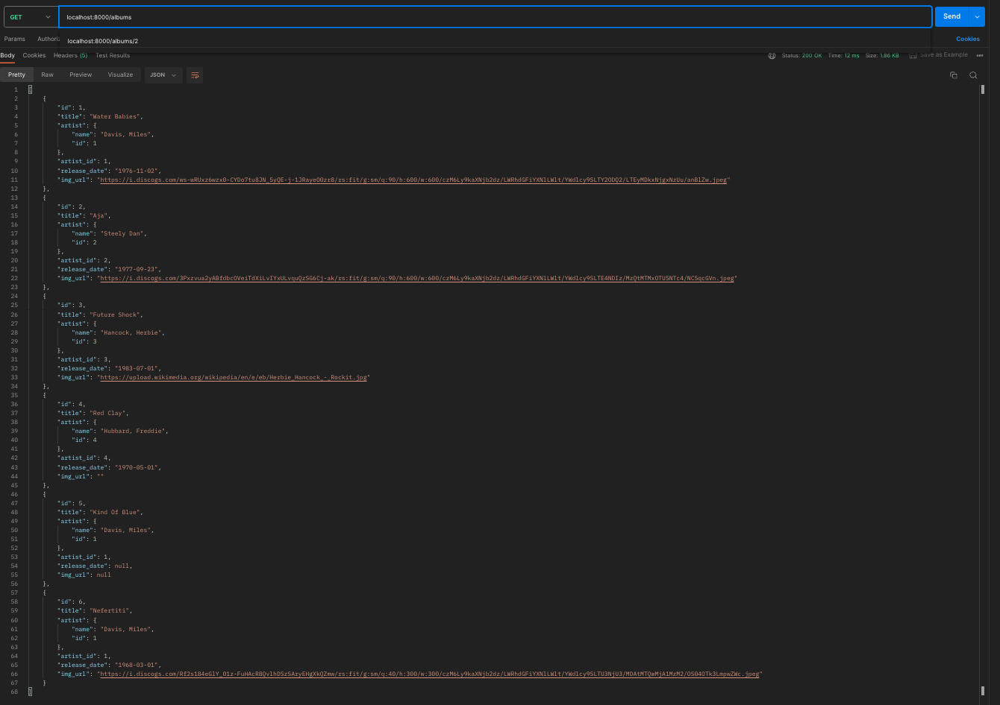
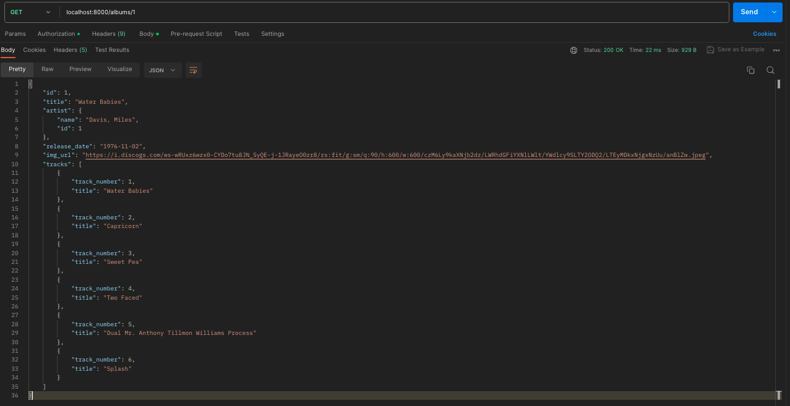
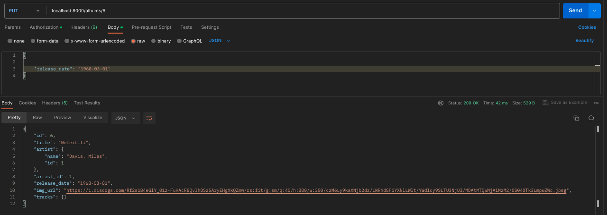
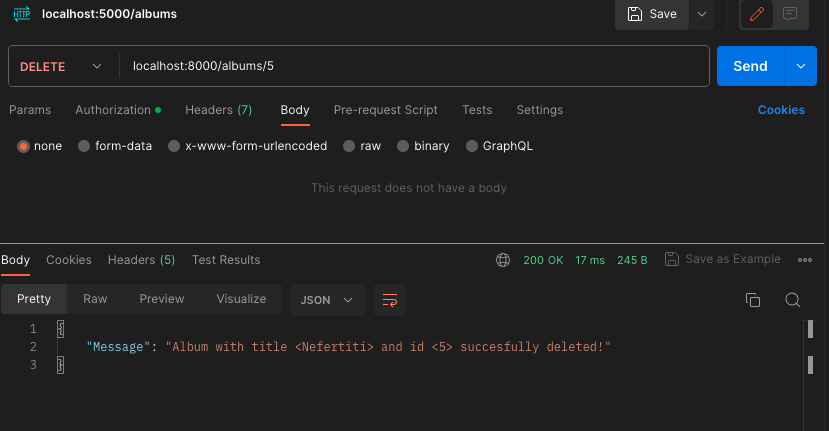
<hr>


## Artist

Artists represent either the person or group name an album is released by.


### **POST** `/artists`

Creates a new artist record and adds to the database.  
*Admin credentials required.*

- Methods: **POST**
- Parameters: None
- Headers: Authorization: {Bearer Token}
- Response: _201_
- Response: _400_, _401_


### **GET** `/artists`

Retrieves a list of all artists in the database.

- Methods: **GET**
- parameters: None
- Headers: Authorization: {Bearer Token}
- Response: _200_
- Response: _401_


### **GET** `/artists/{artist_id}`

Retrieves a single artist from the database.

- Methods: **GET**
- Parameters:
  - **artist_id**: `Integer` _Required_  
     The id of the artist you are attempting to access.
- Headers: Authorization: {Bearer Token}
- Response: _200_
- Response: _401_, _404_


### **PUT/PATCH** `/artists/{artist_id}`

Update an artist from the database.  
*Admin credentials required.*

- Methods: **PUT/PATCH**
- Parameters: 
  - **artist_id**: `Integer` _Required_  
     The id of the artist you are attempting to update.
- Headers: Authorization: {Bearer Token}
- Response: _201_
- Response: _400_, _401_, _404_


### DELETE `/artists/{artist_id}`

Deletes an artist from the database.  
*Admin credentials required.*

- Methods: DELETE
- Parameters: 
  - **artist_id**: `Integer` _Required_  
     The id of the artist you are attempting to delete.
- Headers: Authorization: {Bearer Token}
- Response: _200_
- Response: _401_, _404_  

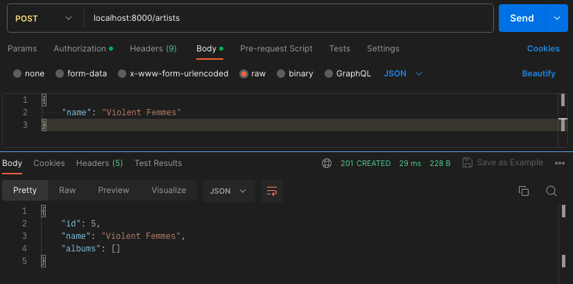
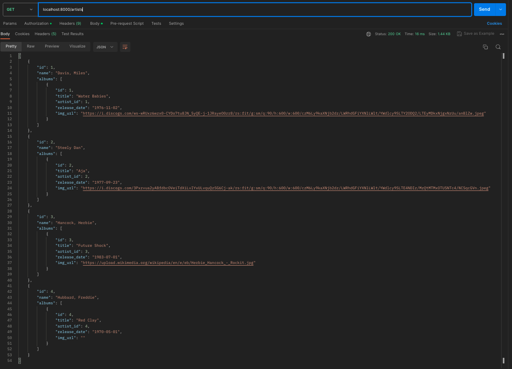
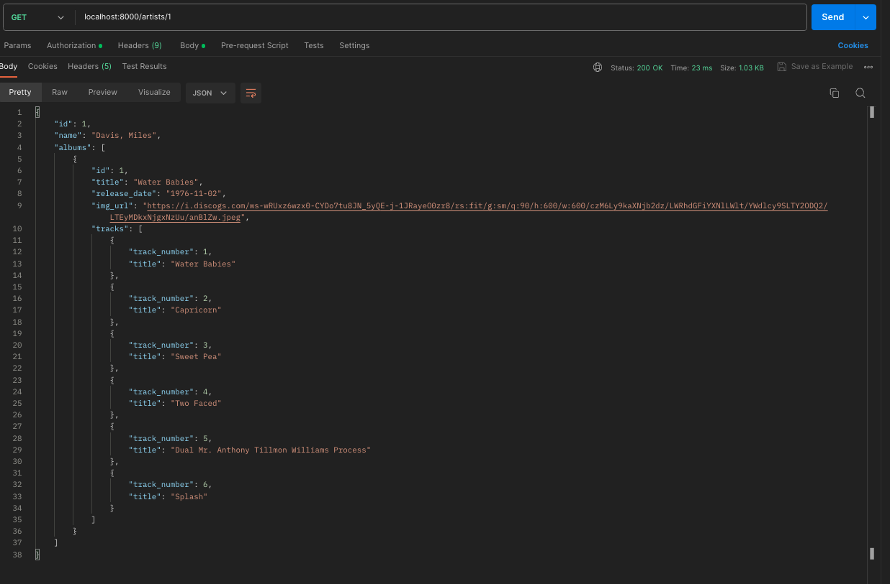
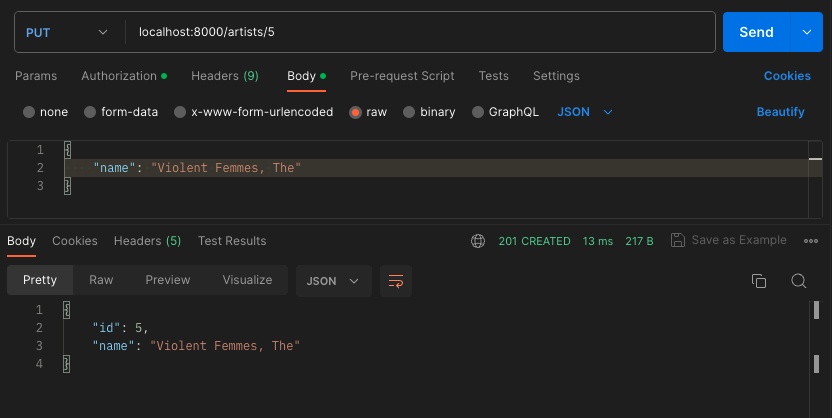
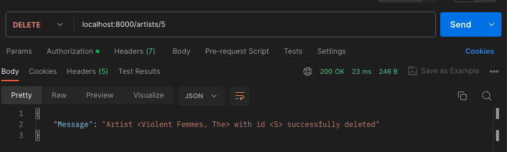

<hr>


## Track

Tracks represent individual songs, and may or may not be associated with an album. It is completely permissible for them to exist as their own entities, and they can be updated at a later date to asssociate them with an album release. 


### **POST** `/tracks`

Creates a new track record and adds it to the database.  
*Admin credentials required.*

- Methods: **POST**
- Parameters: None
- Headers: Authorization: {Bearer Token}
- Response: _201_
- Response: _400_, _401_

### **GET** `/tracks/{track_id}`

Retrieves a single track from the database.

- Methods: **GET**
- Parameters:
  - **track_id**: `Integer` _Required_  
     The id of the track you are attempting to access.
- Headers: Authorization: {Bearer Token}
- Response: _200_
- Response: _401_, _404_


### **PUT/PATCH** `/tracks/{track_id}`

Update an track from the database.  
*Admin credentials required.*

- Methods: **PUT/PATCH**
- Parameters: 
  - **track_id**: `Integer` _Required_  
     The id of the track you are attempting to update.
- Headers: Authorization: {Bearer Token}
- Response: _201_
- Response: _400_, _401_, _404_


### DELETE `/tracks/{track_id}`

Deletes a track from the database.  
*Admin credentials required.*

- Methods: DELETE
- Parameters: 
  - **track_id**: `Integer` _Required_  
     The id of the track you are attempting to delete.
- Headers: Authorization: {Bearer Token}
- Response: _200_
- Response: _401_, _404_  

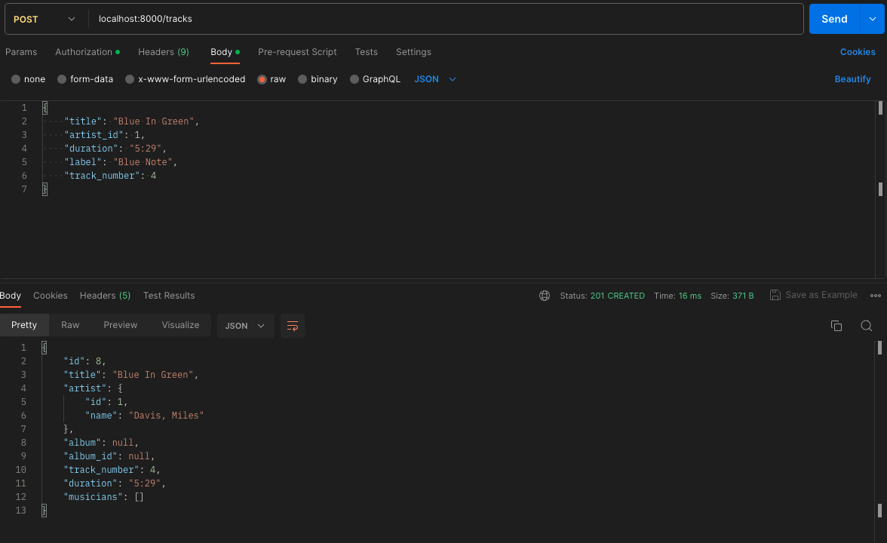
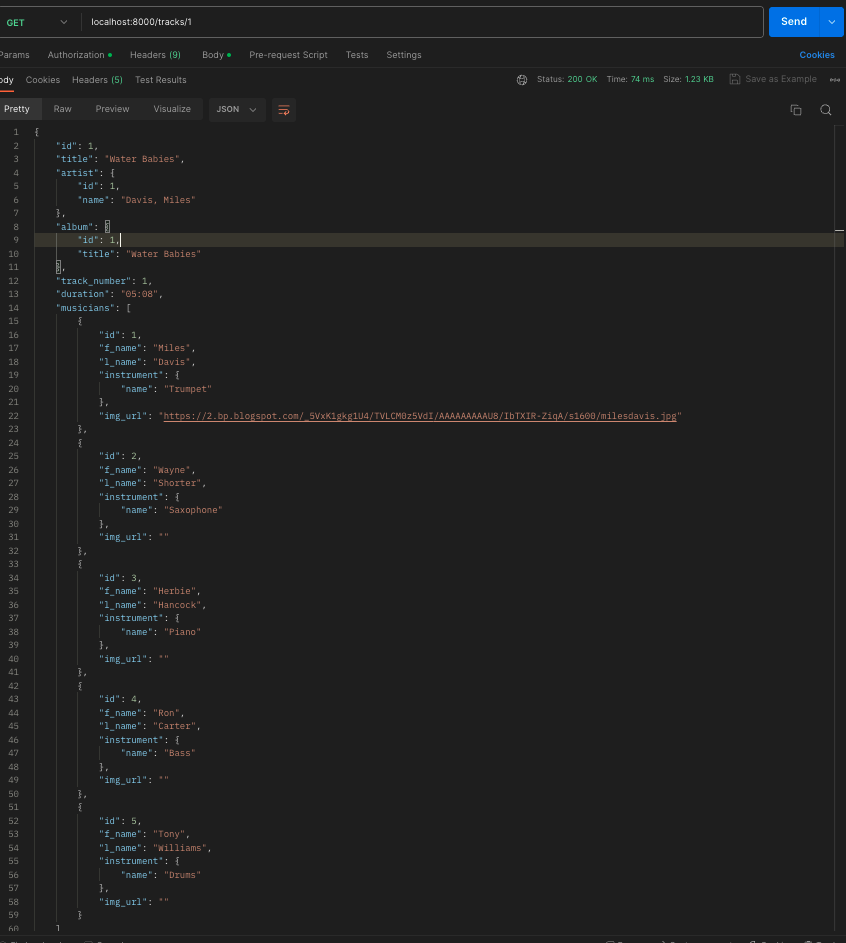
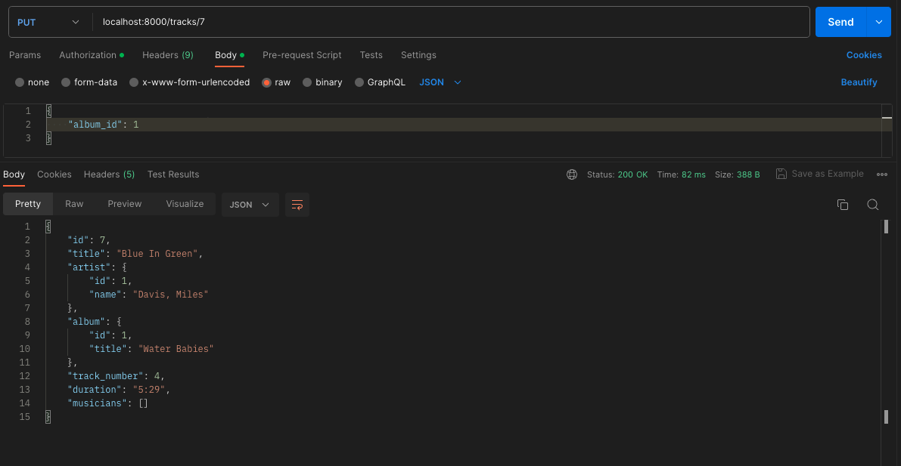
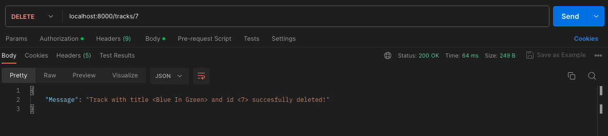

<hr>


## Musician

Musicians represent the individual contributors of an album. For example, if The Beach Boys represent the Artist, the musicians would be all the members of the wrecking crew who performed on the songs. 


### **POST** `/musicians`

Creates a new musician record and adds it to the database.  
*Admin credentials required.*

- Methods: **POST**
- Parameters: None
- Headers: Authorization: {Bearer Token}
- Response: _201_
- Response: _400_, _401_


### **GET** `/musicians`

Retrieves a list of all musicians in the database.

- Methods: **GET**
- parameters: None
- Headers: Authorization: {Bearer Token}
- Response: _200_
- Response: _401_


### **GET** `/musicians/{musician_id}`

Retrieves a single musician from the database.

- Methods: **GET**
- Parameters:
  - **musician_id**: `Integer` _Required_  
     The id of the musician you are attempting to access.
- Headers: Authorization: {Bearer Token}
- Response: _200_
- Response: _401_, _404_


### **PUT/PATCH** `/musicians/{musician_id}`

Update an musician from the database.  
*Admin credentials required.*

- Methods: **PUT/PATCH**
- Parameters: 
  - **musician_id**: `Integer` _Required_  
     The id of the musician you are attempting to update.
- Headers: Authorization: {Bearer Token}
- Response: _201_
- Response: _400_, _401_, _404_


### DELETE `/musicians/{musician_id}`

Deletes a musician from the database.  
*Admin credentials required.*

- Methods: DELETE
- Parameters: 
  - **musician_id**: `Integer` _Required_  
     The id of the musician you are attempting to delete.
- Headers: Authorization: {Bearer Token}
- Response: _200_
- Response: _401_, _404_  

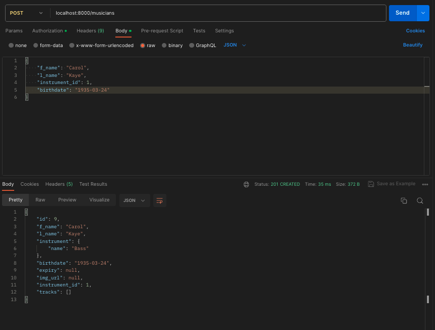
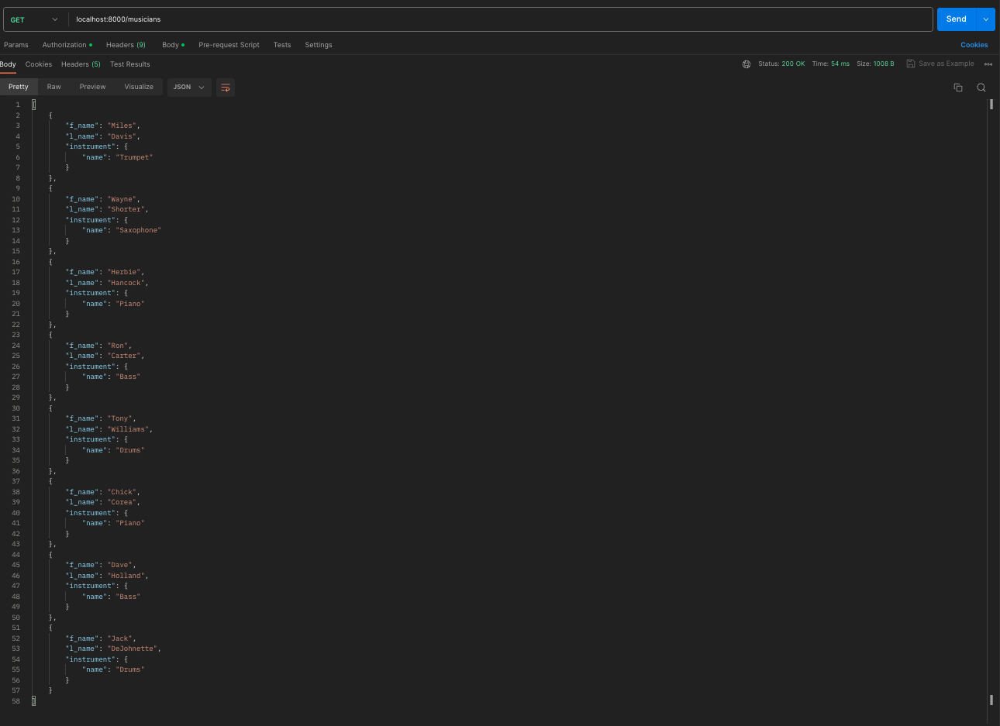
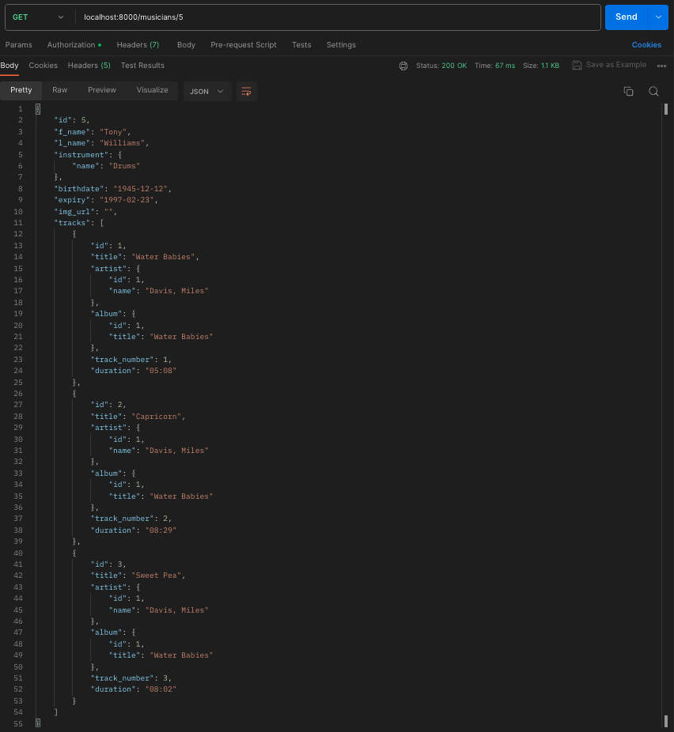
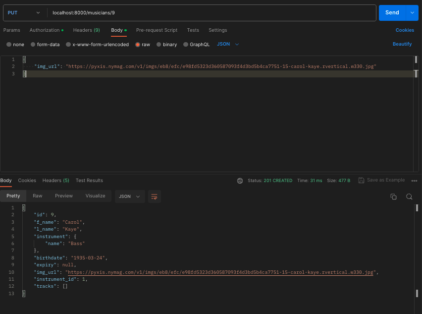
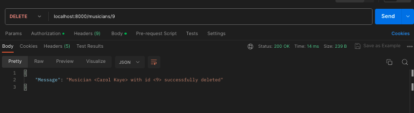

<hr>


## Credit

Credits represents the association between musicians and tracks. They are simple join records so the only provided routes are creation and deletion. Deleting a record can be accomplished by supplying the record id, or with a query string supplying `track_id` and `musician_id`.


### **POST** `/credit`

Creates a new track_musician association and adds it to the database.  
*Admin credentials required.*

- Methods: **POST**
- Parameters: None
- Headers: Authorization: {Bearer Token}
- Response: _201_
- Response: _400_, _401_

### **DELETE** `/credit/{credit_id}`  
 *optional locate with query paramaters:*  
  **DELETE** `/credit/0/track_id={integer}&musician_id={integer}`

Creates a new track record and adds it to the database.  
*Admin credentials required.*

- Methods: **DELETE**
- Parameters: 
  - **credit_id**: `Integer` _Required_  
     The id of the musician you are attempting to delete.
  - if **credit_id** is set to `0` query paramaters can be used to locate and delete credit instead of credit_id:
    - `{musician_id}`: integer ID representing the musician to locate
    - `{track_id}`: integer ID representing the track to locate
    - example url: `/credit/0/track_id={integer}&musician_id={integer}`
- Headers: Authorization: {Bearer Token}
- Response: _200_
- Response: _400_, _401_, _404_

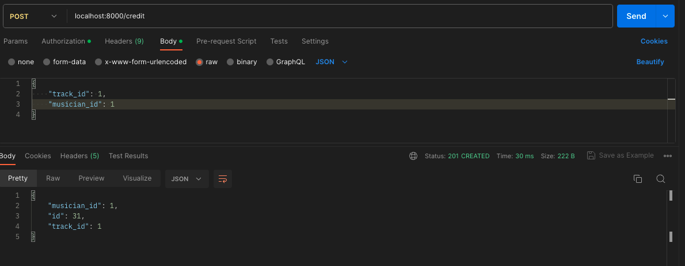
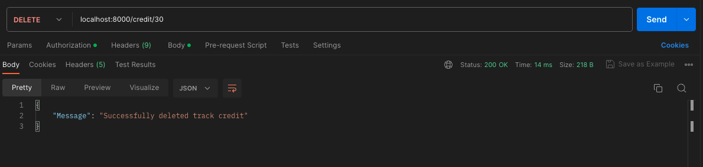
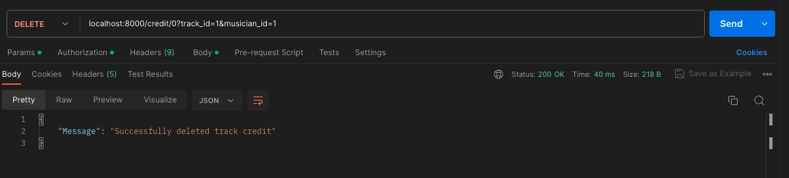
<hr>


## Instrument

The Instruments table is a collection of availabe instruments to be associated with musicians. It is meant to be a static collection so the routes are limited and only include an indexed list of all available instruments with their corresponding IDs.

### **GET** `/instruments`

Retrieves a list of all instruments in the database.

- Methods: **GET**
- parameters: None
- Headers: Authorization: {Bearer Token}
- Response: _200_  
- Response: _401_  

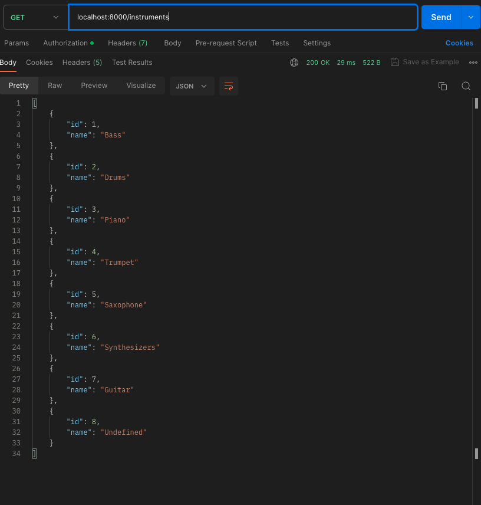


<hr>

### Auth and Validation errors examples:  

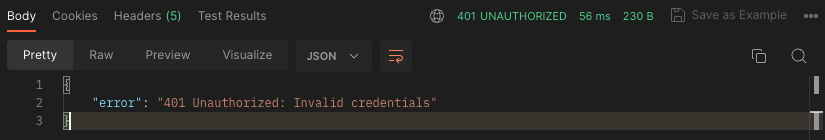  
Requesting access to admin only area without proper auth

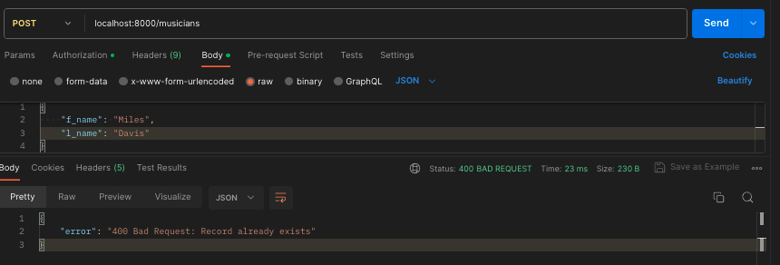 
Error: post request for musician that already has a record in the database  

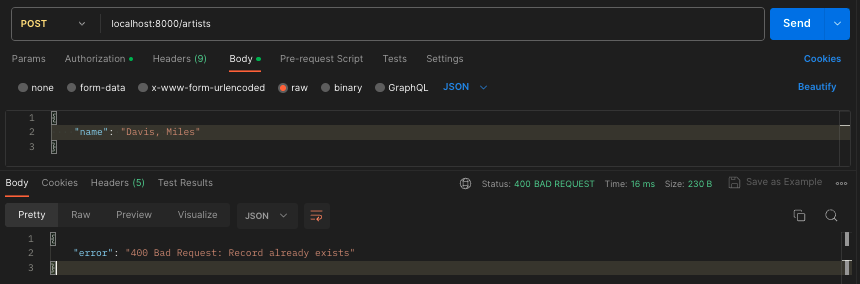  
Error: post request for artist that already has a record in the database  

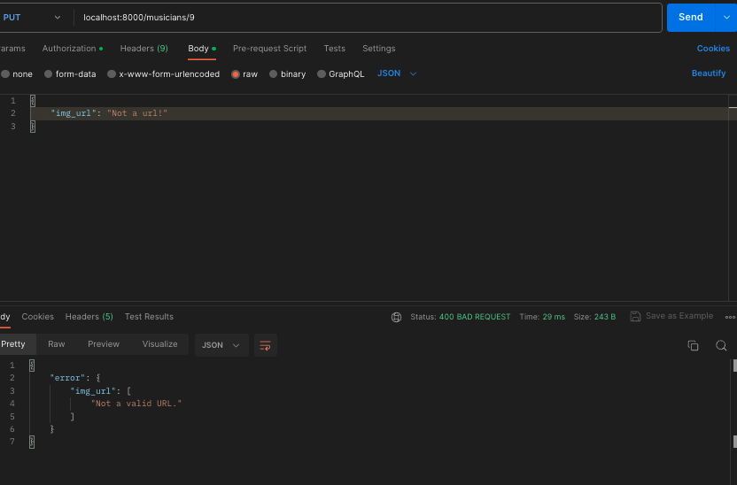

Validation error for attempting to update record with an invalid url.